# Trading Bot Flow Diagram

This diagram shows the exact sequence and timing of all trading bot activities, including decision points and periodic operations.

```mermaid
sequenceDiagram
    participant TB as TradingBot
    participant MD as MarketData
    participant OM as OrderManager
    participant PM as PositionManager
    participant ST as Strategy
    participant EX as Exchange
    participant CB as CircuitBreaker

    Note over TB: Bot Startup
    TB->>MD: Initialize market data
    TB->>OM: Initialize order manager
    TB->>PM: Initialize position manager
    TB->>ST: Initialize strategy
    TB->>EX: Connect to exchange
    TB->>TB: Setup WebSocket connections

    Note over TB: Main Trading Loop (Every 3 seconds)
    loop Every 3 seconds
        TB->>TB: Check shutdown request
        
        Note over TB: Phase 1: Daily Reset Check
        TB->>TB: Check for new trading day
        alt New Day Detected
            TB->>TB: Update _last_trading_day
            TB->>TB: Log new trading day event
            Note right of TB: Uses fresh exchange data
        end

        Note over TB: Phase 2: Display Current Signals
        loop For each trading market
            TB->>ST: Get current signal
            TB->>TB: Get account balance
            TB->>TB: Calculate position size
            alt Signal exists and valid
                TB->>TB: Log daily signal summary
                Note right of TB: Shows buy/sell prices, amounts
            end
        end

        Note over TB: Phase 3: Periodic Updates
        alt Account update needed (every 120s)
            TB->>TB: _update_account_status()
            TB->>EX: Fetch account balance
            TB->>TB: Update _last_account_update
        end

        alt Position sync needed (every 60s)
            TB->>TB: _sync_positions()
            TB->>PM: Sync all positions with exchange
            TB->>TB: Update _last_positions_sync
        end

        Note over TB: Phase 4: Process Pairing Tasks
        TB->>TB: _process_pairing_tasks()
        TB->>OM: Process unmatched buy fills

        Note over TB: Phase 5: Disk Space Check
        alt Once per day (86400s)
            TB->>TB: Check disk space
            TB->>TB: Update _last_disk_check
        end

        Note over TB: Phase 6: Process Each Market
        loop For each trading market
            TB->>TB: _process_market(market)
            
            Note over TB: Phase 6.1: Signal Generation Check
            TB->>TB: _check_and_generate_signals(market)
            TB->>TB: Check if signal generation time reached
            alt Signal generation time + no today's signal
                TB->>ST: generate_daily_signal(market)
                TB->>TB: Update last_signal_generation
                TB->>OM: Configure pairing rule with new sell price
                Note right of TB: Uses market-specific min_amount
            end

            TB->>ST: get_current_signal(market)
            alt No active signal
                Note right of TB: Skip this market
            else Signal exists
                Note over TB: Phase 6.2: Check Orphaned Positions
                TB->>TB: _check_and_cover_orphaned_positions(market)
                TB->>PM: get_position(market)
                TB->>OM: get_pending_orders(market) - sell orders only
                alt Uncovered position detected
                    TB->>TB: Log orphaned position warning
                    TB->>OM: place_sell_order(uncovered_amount)
                    Note right of TB: ONLY places SELL orders
                end

                Note over TB: Phase 6.3: Exit Opportunities
                TB->>TB: _check_exit_opportunities(market, signal)
                TB->>PM: get_position(market)
                alt Position exists
                    TB->>MD: get_current_price(market)
                    TB->>TB: Calculate exit price based on position side
                    TB->>TB: Validate profitability
                    alt Position is profitable
                        TB->>TB: _place_exit_order(position, exit_price)
                    end
                end

                Note over TB: Phase 6.4: Entry Opportunities
                TB->>TB: _check_entry_opportunities(market, signal)
                TB->>MD: get_current_price(market)

                Note over TB: Phase 6.4.1: Cleanup Check
                TB->>TB: _get_exchange_buy_status(market)
                TB->>EX: Get all pending buy orders
                alt Multiple buy orders detected
                    TB->>TB: _ensure_single_buy_order(market)
                    TB->>OM: Cancel duplicate orders
                    TB->>TB: Verify cleanup success
                end

                Note over TB: Phase 6.4.2: Buy Decision Logic
                TB->>TB: _should_place_buy_order(market, signal, current_price)
                
                rect rgb(255, 220, 220)
                    Note over TB: CRITICAL SAFETY CHECKS
                    TB->>CB: should_allow_action(market, "buy_order")
                    alt Circuit breaker blocks
                        Note right of TB: Cooldown: 30s for buy orders
                    end
                    
                    TB->>OM: get_pending_orders(market) - buy orders
                    alt Pending buy orders exist
                        Note right of TB: Block: Wait for existing orders
                    end
                    
                    TB->>TB: _get_today_pending_sell_orders(market)
                    alt Pending sell orders from today exist
                        Note right of TB: EMERGENCY BLOCK: Prevents duplicate buys
                    end
                end

                rect rgb(220, 255, 220)
                    Note over TB: BUY DECISION LOGIC
                    TB->>TB: Check cycle completion flag
                    alt Cycle just completed
                        TB->>ST: generate_daily_signal(market, force=True)
                        Note right of TB: Fresh signal for new cycle
                    else No today's buy orders + no pending sells
                        Note right of TB: STARTUP: First buy of day
                    else Normal operation
                        Note right of TB: Wait for cycle completion
                    end
                end

                alt Buy order should be placed
                    TB->>TB: Get account balance
                    TB->>TB: Calculate position size
                    alt Position size valid
                        TB->>TB: _place_entry_order(market, 'buy', buy_price, signal)
                        TB->>OM: place_buy_order()
                        TB->>EX: Submit buy order to exchange
                        alt Order placed successfully
                            TB->>TB: Clear cycle completion flag
                            TB->>TB: Log successful order placement
                        end
                    end
                end
            end
        end
    end

    Note over TB: Circuit Breaker Cooldown Periods
    Note right of CB: Emergency operations: 5s
    Note right of CB: Buy/Sell orders: 30s  
    Note right of CB: Cleanup operations: 45s
    Note right of CB: Sync operations: 60s

    Note over TB: Key Timing Summary
    Note right of TB: Main loop: Every 3 seconds
    Note right of TB: Account updates: Every 120 seconds
    Note right of TB: Position sync: Every 60 seconds
    Note right of TB: Daily signals: At SIGNAL_GENERATION_TIME (00:00 UTC)
    Note right of TB: Disk check: Once per day (86400 seconds)
```

## Key Flow Elements

### 1. **Startup Sequence**
- Initialize all components (market data, order manager, position manager, strategy)
- Connect to exchange and setup WebSocket connections

### 2. **Main Loop (Every 3 seconds)**
The bot continuously executes a 6-phase process:

#### Phase 1: Daily Reset Check
- Detects new trading day
- Logs transition and uses fresh exchange data

#### Phase 2: Display Current Signals  
- Shows active signals for all markets
- Calculates and displays position sizes and amounts

#### Phase 3: Periodic Updates
- **Account Balance**: Updates every 120 seconds
- **Position Sync**: Updates every 60 seconds

#### Phase 4: Process Pairing Tasks
- Handles unmatched buy fills
- Manages order pairing logic

#### Phase 5: Disk Space Check
- Runs once per day (86400 seconds)

#### Phase 6: Market Processing
For each trading market, executes 4 sub-phases:

##### Phase 6.1: Signal Generation Check
- Checks if it's time to generate new daily signals
- Updates pairing rules with new sell prices

##### Phase 6.2: Orphaned Position Check
- **CRITICAL**: Runs independently every cycle
- Detects positions without sell orders
- **ONLY places SELL orders** to cover uncovered positions

##### Phase 6.3: Exit Opportunities
- Checks existing positions for profitable exits
- Validates profitability before placing exit orders

##### Phase 6.4: Entry Opportunities
Two critical sub-phases:

**Phase 6.4.1: Cleanup Check**
- Detects multiple buy orders
- Ensures only one buy order exists per market

**Phase 6.4.2: Buy Decision Logic**
- **Safety Checks** (RED): Circuit breaker, pending orders, emergency blocks
- **Decision Logic** (GREEN): Cycle completion, first buy of day, normal operation

### 3. **Safety Mechanisms**

#### Circuit Breaker Cooldowns:
- **Emergency operations**: 5 seconds
- **Buy/Sell orders**: 30 seconds  
- **Cleanup operations**: 45 seconds
- **Sync operations**: 60 seconds

#### Critical Safety Blocks:
1. **Circuit Breaker**: Prevents rapid-fire operations
2. **Pending Buy Orders**: Waits for existing orders to fill
3. **Emergency Block**: Prevents duplicate buys when pending sells exist from today

#### Decision States:
1. **Cycle Completion**: Allows new buy after successful sell
2. **First Buy of Day**: Allows startup buy when no pending sells exist
3. **Normal Operation**: Waits for cycle completion

### 4. **Key Timing Intervals**
- **Main Loop**: 3 seconds (configurable, optimized for volatile markets)
- **Account Updates**: 2 minutes (balance tracking)
- **Position Sync**: 1 minute (critical state validation)
- **Daily Signals**: At configured time (default: 00:00 UTC)
- **Disk Space Check**: Once per day

This flow ensures:
- **Position Safety**: All positions are covered by sell orders
- **Order Consistency**: No duplicate orders
- **Timing Precision**: Activities occur at optimal intervals
- **Error Recovery**: Robust error handling and state validation